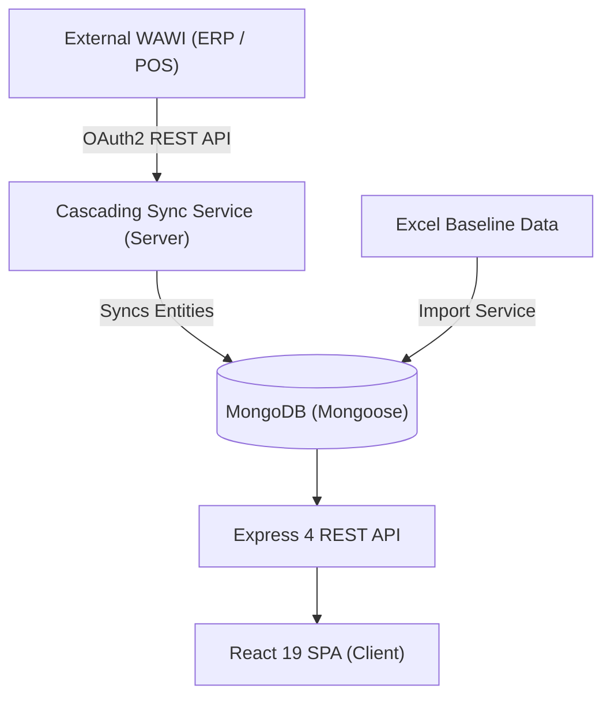

# Grandios Bonus System: Architecture & End-to-End Workflow

The **Grandios App** is a customer loyalty and bonus management platform for retail. It synchronizes point-of-sale (POS) data from an external WAWI (ERP/POS based on Odoo-style models), processes purchases, manages customer bonus wallets, and automates a **3-purchase 10% bonus rule** with support for historical Excel data, return netting, and manual group management.

---

## 1. High-Level Architecture

### Tech Stack
- **Frontend**: React 19, Tailwind CSS v3, React Router v7, React Hot Toast, Vanilla Fetch API client (`client/src/services/api.js`).
- **Backend**: Node.js, Express 4, MongoDB with Mongoose, JWT Authentication, bcryptjs.
- **External Integration**: WAWI OAuth2 REST API Client with automatic token refresh, retry logic, and rate-limit backoff.
- **Process Management**: PM2 Cluster Mode (only instance `0` runs background sync schedulers).

---

## 2. Core Business Logic & Rules

### 1. The 3-Purchase Bonus Rule (Rabatt-Gruppen)
- Customers collect eligible purchases. Every **3 eligible purchases** form a **Discount Group** (`DiscountOrder`).
- **Bonus Value**: 10% (configurable via `AppSettings`) of the sum of eligible purchase amounts.
- **Available vs Redeemed**: Once formed, groups are `available`. When a customer redeems a bonus in POS, the group status changes to `redeemed`, updating `Customer.wallet` and `Discount.balance`.

### 2. Item & Order Eligibility (`isItemEligibleForBonus`)
- **Included**: Regular full-price products (`discount == 0` or not set).
- **Excluded**:
  - Sale / already discounted items (`discount > 0` on positive amount).
  - Gift vouchers / coupons (`gutschein`, `voucher`, `gift`).
  - Bonus cards (`bonus kundenkarte`).
  - Manual special discounts (`sonderrabatt`).
- **Returns & Netting**: Negative-amount order lines (returns/refunds) pass through eligibility checks to net against positive purchases in the signed sum.

### 3. Stichtag (Go-Live Cutoff Date)
- Controlled via `STICHTAG=YYYY-MM-DD` in `server/.env`.
- **Purpose**: Separates historical pre-go-live purchases (managed via Excel import) from live WAWI POS sync.
- **Sync Behavior**: WAWI order sync only fetches and groups orders where `date_order >= STICHTAG`.
- **UI Behavior**: Displays pre-Stichtag data as historical baseline and post-Stichtag data as live WAWI transactions.

### 4. Excel Historical Baseline & Carryovers (`OldPurchase`, `CustomerPurchaseHistory`)
- Pre-Stichtag history is imported from customer Excel sheets.
- **Completed Groups**: Full historical groups of 3 are stored in `CustomerPurchaseHistory` / `DiscountOrder` (source: `excel`).
- **Partial Streaks / Carryovers**: If a customer had 1 or 2 purchases prior to Stichtag (`carryoverPurchases`, `streakCount`), these are carried over and **prepended to their first post-Stichtag WAWI discount group** to complete a group of 3.

### 5. Return Deductions (`pendingReturnDeduction`)
- If a customer returns items from an already rewarded or redeemed transaction:
  - Negative bonus accrued is stored in `Customer.pendingReturnDeduction`.
  - When the customer redeems their next discount group, `pendingReturnDeduction` is subtracted from the payout amount, and `Customer.totalReturnDeduction` tracks cumulative deductions.

### 6. Multi-Order Bundling (`bundleIndex`)
- Users can bundle multiple smaller orders into a single purchase slot within a 3-item group using `bundleIndex`.

---

## 3. Database Schema & Models (`server/models/`)

| Model | File | Description |
| :--- | :--- | :--- |
| `Customer` | [Customer.js](file:///media/lenovo-lp/ssd/leoprinting%20projects/gradios/grandios-app/server/models/Customer.js) | Customer master (contactId, ref, name, email, address, wallet, pendingReturnDeduction, carryoverPurchases, streakCount, draftDiscountItems). |
| `Order` | [Order.js](file:///media/lenovo-lp/ssd/leoprinting%20projects/gradios/grandios-app/server/models/Order.js) | POS Orders synced from `pos.order` (orderId, posReference, customerId, amountTotal, amountTotalBonusApplied, orderLines, state). |
| `OrderLine` | [OrderLine.js](file:///media/lenovo-lp/ssd/leoprinting%20projects/gradios/grandios-app/server/models/OrderLine.js) | Individual items in an order (`pos.order.line`) with priceUnit, quantity, discount, refundedQty, and discountEligible flags. |
| `Discount` | [Discount.js](file:///media/lenovo-lp/ssd/leoprinting%20projects/gradios/grandios-app/server/models/Discount.js) | Customer wallet balance, totalGranted, totalRedeemed. |
| `DiscountOrder` | [DiscountOrder.js](file:///media/lenovo-lp/ssd/leoprinting%20projects/gradios/grandios-app/server/models/DiscountOrder.js) | Groups of 3 orders (or baseline items) with calculated totalAmount, totalDiscount, bundle indices, status (`available`/`redeemed`), and source (`wawi`/`excel`). |
| `CustomerPurchaseHistory` | [CustomerPurchaseHistory.js](file:///media/lenovo-lp/ssd/leoprinting%20projects/gradios/grandios-app/server/models/CustomerPurchaseHistory.js) | Archival records of Excel-imported customer purchases, completed purchase groups, and pending baseline streaks. |
| `OldPurchase` | [OldPurchase.js](file:///media/lenovo-lp/ssd/leoprinting%20projects/gradios/grandios-app/server/models/OldPurchase.js) | Granular line items from Excel baseline used to reconstruct carryovers if groups are modified or deleted. |
| `OrderCustomerQueue` | [OrderCustomerQueue.js](file:///media/lenovo-lp/ssd/leoprinting%20projects/gradios/grandios-app/server/models/OrderCustomerQueue.js) | Unassigned POS orders (e.g., guest checkouts) waiting to be matched to a customer. |
| `Product`, `ProductAttribute`, `ProductAttributeValue` | `Product*.js` | Catalog items and attributes synced from WAWI (`product.product`, `product.attribute`). |
| `AppSettings` | [AppSettings.js](file:///media/lenovo-lp/ssd/leoprinting%20projects/gradios/grandios-app/server/models/AppSettings.js) | Global configurations: `discountRate` (default 10%), `itemsPerDiscountGroup` (default 3), `autoCreateDiscountGroups` (boolean). |
| `NotesHistory` | [NotesHistory.js](file:///media/lenovo-lp/ssd/leoprinting%20projects/gradios/grandios-app/server/models/NotesHistory.js) | Timestamped audit log of customer notes edited by staff. |
| `User` | [User.js](file:///media/lenovo-lp/ssd/leoprinting%20projects/gradios/grandios-app/server/models/User.js) | System users/admins for web app login (JWT + bcrypt). |

---

## 4. Cascading Sync Pipeline (`cascadingSyncService.js`)

The sync service pulls data from WAWI in strict relational hierarchy:

1. **Customers (`res.partner`)**: Filtered by `["customer_rank", ">", 0]` and `write_date >= lastSync`.
2. **Orders (`pos.order`)**: Filtered by `date_order >= STICHTAG` and `write_date >= lastSync`. Unassigned orders are queued in `OrderCustomerQueue`.
3. **Order Lines (`pos.order.line`)**: Fetched per order and linked to product records.
4. **Products & Attributes (`product.product`, `product.attribute`, `product.attribute.value`)**: Synced and associated with order lines.
5. **Discount Group Calculation**: Evaluates customer orders, respects carryover streaks, creates groups of 3, and updates wallet balances.

---

## 5. Frontend Pages & Routing (`client/src/`)

- **`/dashboard`** ([Dashboard.js](file:///media/lenovo-lp/ssd/leoprinting%20projects/gradios/grandios-app/client/src/pages/Dashboard.js)): Overview KPI statistics, revenue, discount totals, recent orders.
- **`/bonus`** ([Bonus.js](file:///media/lenovo-lp/ssd/leoprinting%20projects/gradios/grandios-app/client/src/pages/Bonus.js)): Customer bonus table with active balance, redeemable groups, streak status, search, and pagination.
- **`/bonus/:id`** ([BonusDetail.js](file:///media/lenovo-lp/ssd/leoprinting%20projects/gradios/grandios-app/client/src/pages/BonusDetail.js)): Customer detail view:
  - 3-purchase bonus group builder and editor.
  - Manual group creation, bundling, draft saving.
  - Live order history (Einkäufe) and returns inspection.
  - Excel baseline history accordion.
  - Notes history editor.
  - Instant customer order sync button.
- **`/bonus/:id/tilgen`** ([BonusTilgen.js](file:///media/lenovo-lp/ssd/leoprinting%20projects/gradios/grandios-app/client/src/pages/BonusTilgen.js)): Bonus redemption processing view.
- **`/bestellungen`** ([Bestellungen.js](file:///media/lenovo-lp/ssd/leoprinting%20projects/gradios/grandios-app/client/src/pages/Bestellungen.js)): Order listing with search, date filters, status filters, and order line modal.
- **`/kunden`** ([Kunden.js](file:///media/lenovo-lp/ssd/leoprinting%20projects/gradios/grandios-app/client/src/pages/Kunden.js)): Customer directory, contact details, sync status.
- **`/einstellungen`** ([Einstellungen.js](file:///media/lenovo-lp/ssd/leoprinting%20projects/gradios/grandios-app/client/src/pages/Einstellungen.js)): System settings, sync triggers, Stichtag status, WAWI connection status.

---

## 6. Key API Endpoints Reference

### Authentication (`/api/auth`)
- `POST /api/auth/login`: User login returning JWT.
- `GET /api/auth/me`: Get current authenticated user.

### Discounts / Bonus (`/api/discounts`)
- `GET /api/discounts`: List all customer discounts and wallet balances.
- `GET /api/discounts/:customerId`: Fetch full bonus details, available groups, draft groups, and carryover status for a customer.
- `POST /api/discounts/group`: Create a custom 3-purchase discount group (supports bundling & carryovers).
- `PUT /api/discounts/group/:groupId`: Update an existing discount group.
- `POST /api/discounts/redeem`: Redeem an available discount group and adjust wallet / return deductions.
- `DELETE /api/discounts/group/:groupId`: Delete a discount group and restore order availability + carryovers.
- `POST /api/discounts/draft/:customerId`: Save draft items for customer bonus builder.
- `POST /api/discounts/sync/:customerId`: Trigger instant WAWI sync for a single customer.

### Sync & WAWI (`/api/sync`, `/api/wawi`)
- `POST /api/sync/cascade`: Trigger full or incremental cascading sync.
- `GET /api/sync/cascade/status`: Check current progress of running sync.
- `POST /api/wawi/test`: Test connection and token exchange with external WAWI.

---

## 7. Common Development & Troubleshooting Patterns

### Running the App
- **Server**: `cd server && npm run dev` (starts on port 5000)
- **Client**: `cd client && npm start` (starts on port 3000)

### Handling Sync & WAWI Timeouts
- Per-customer sync uses lightweight product queries (`PRODUCT_FIELDS_LIGHT`, excluding heavy `image_512`) to prevent 504 Gateway Timeouts from WAWI.
- PM2 scheduler is guarded with `process.env.NODE_APP_INSTANCE === "0"` to avoid duplicate concurrent sync workers.

### Recalculating Customer Balances
- Whenever groups are released or deleted, use `restoreCarryoverFromOldPurchases(customerId)` to re-anchor Excel carryover streaks from authoritative `OldPurchase` documents.
